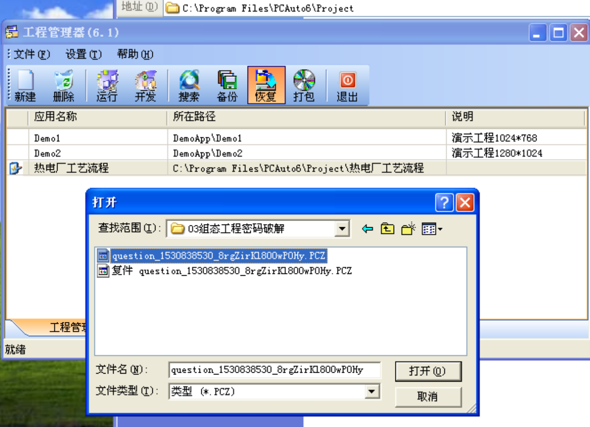

##### Tools

------

https://github.com/atimorin/scada-tools

http://code.google.com/p/plcscan

https://github.com/bl4ckic3/Modbus-Fuzzer

https://github.com/dathlin/HslCommunication

##### S7comm

------

[工控安全 | 西门子通信协议S7COMM（Part 1） ](https://www.freebuf.com/articles/ics-articles/188159.html)

[工控安全 | 西门子通信协议S7COMM（Part 2）](https://www.freebuf.com/articles/ics-articles/188606.html)

[https://nmap.org/nsedoc/scripts/s7-info.html](https://nmap.org/nsedoc/scripts/s7-info.html)

[https://github.com/meeas/plcscan](https://github.com/meeas/plcscan)

##### .ap13

------

.ap13需要TIA PORTAL v13 sp1来打开

[ https://support.industry.siemens.com/cs/mdm/109742302?c=92338901003&lc=zh-CN ]

| TIA Portal 的产品版本（相应版本的文件扩展名）                | 使用最新版本 TIA Portal 打开时的操作步骤                     |
| ------------------------------------------------------------ | ------------------------------------------------------------ |
| V10.5 (.ap10) V11.x (.ap11)        V12 (.ap12)  V12 SP1 (.ap12)      V13 (.ap13) | 将显示一条消息，提示需使用版本产品 V13 SP1 打开该项目。                  使用产品版本 V13 SP1 打开该项目并经过用户确认后，该项目将自动升级为项目格式 V13 SP1（文件扩展名为“.ap13”）。 |
| V13 SP1 (.ap13)                                              | 使用产品版本 V14 打开该项目并经过用户确认后，该项目将自动升级为项目格式 V14（文件扩展名为“.ap14”）。 升级后的项目是原始项目的一个副本，原始项目将保留不更。 |

##### .PCZ

------

.PCZ使用力控组态恢复

